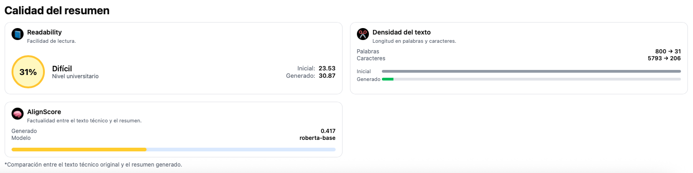
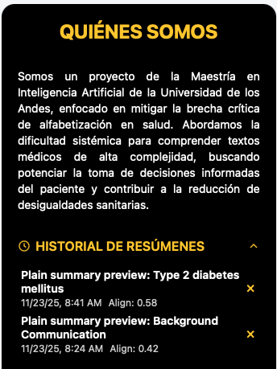

# Generación Automática de Resúmenes Médicos en Lenguaje Sencillo

Este repositorio contiene el código, los datos y los artefactos para el trabajo de grado de maestría titulado "Generación automática de resúmenes médicos en lenguaje sencillo". El proyecto desarrolla y evalúa un sistema de PNL para mejorar la alfabetización en salud, incluyendo un clasificador de estilo y la comparación de modelos de lenguaje afinados (<4B) contra modelos fundacionales (>10B).

**Autores:** M. Álvarez, D. Ayala, M. Hernández, R. Murcia

---

## Índice

- [Visión General de la Arquitectura](#visión-general-de-la-arquitectura)
- [Estructura del Repositorio](#estructura-del-repositorio)
- [Instalación y Requisitos](#instalación-y-requisitos)
- [Uso y Reproducción de Resultados](#uso-y-reproducción-de-resultados)
- [Despliegue de la Aplicación](#despliegue-de-la-aplicación)
  - [Guía Visual del Frontend](#guía-visual-del-frontend)
- [Resultados Clave](#resultados-clave)
- [Licenciamiento](#licenciamiento)

---

## Visión General de la Arquitectura

El sistema final consta de una aplicación web desacoplada que integra los modelos desarrollados, desplegada en la nube de AWS para garantizar escalabilidad y disponibilidad.


- **Front-end (Angular + nginx)**: Sirve la interfaz de usuario (UI) y actúa como proxy, redirigiendo las peticiones de `/api/` al servicio FastAPI.
- **API FastAPI (contenedor `api`)**: Expone los endpoints `/summarize` y `/classify`. Delega la generación de resúmenes a un endpoint de Inferencia de Hugging Face y carga el clasificador TF-IDF+LogReg desde un volumen local.
- **AlignScore service**: Microservicio dedicado al cálculo de la similitud factual, asegurando que las dependencias no entren en conflicto con la API principal.
- **Infraestructura**: Las imágenes de los contenedores (`api`, `front`, `alignscore`) se publican en Amazon ECR. Un script de Terraform aprovisiona una instancia EC2 (t3.large) y despliega la pila de servicios usando Docker Compose.

---

## Estructura del Repositorio

A continuación, se describe la organización del repositorio. Cada carpeta principal contiene su propio `README.md` con información detallada.

| Carpeta | Descripción | Guía Detallada |
| :--- | :--- | :--- |
| **`reports/`** | Contiene el artículo científico (`MAIA - Paper.pdf`) y todas las figuras y diagramas. | N/A |
| **`data/`** | Almacena los datasets de entrada y los resultados tabulados de los experimentos. | **[`data/README.md`](data/README.md)** |
| **`notebooks/`** | Documenta el flujo de investigación, entrenamiento y evaluación de modelos. | **[`notebooks/README.md`](notebooks/README.md)** |
| **`models/`** | Contiene los artefactos finales y entrenados de los modelos (clasificador y generador). | **[`models/README.md`](models/README.md)** |
| **`deployment/`**| Incluye todo el código para el despliegue de la aplicación (API, UI, Infraestructura). | **[`deployment/README.md`](deployment/README.md)** |

---

## Instalación y Requisitos

Para reproducir los experimentos de investigación, clona el repositorio y asegúrate de tener un entorno de Python 3.10+ y Jupyter. Las dependencias específicas se detallan en los propios notebooks.

```bash
git clone https://github.com/deayala/med-plain-language-summarizer.git
cd med-plain-language-summarizer
```

Para el despliegue de la aplicación, consulta la guía detallada en [`deployment/README.md`](deployment/README.md).

---

## Uso y Reproducción de Resultados

Los notebooks principales guían a través del proceso de investigación y modelado. Para una descripción más profunda de cada uno, consulta la [guía de notebooks](notebooks/README.md).

-   **`notebooks/1_pls_generator_finetuning.ipynb`**: Notebook maestro que consolida el fine-tuning de MedGemma y el análisis comparativo con modelos SOTA.
-   **`notebooks/2_pls_classifier.ipynb`**: Notebook dedicado al entrenamiento y evaluación del clasificador de estilo PLS.

---

## Despliegue de la Aplicación

Las instrucciones técnicas para construir las imágenes de Docker, provisionar la infraestructura en AWS y lanzar la aplicación se encuentran en la guía de despliegue:
-   **[Guía de Despliegue](deployment/README.md)**

### Guía Visual del Frontend

La interfaz de usuario es intuitiva y se concentra en una única vista para facilitar el flujo de trabajo.

1.  **Pantalla inicial:** Vista limpia con acceso directo a la funcionalidad principal.
    

2.  **Ingreso de texto:** Área para pegar el texto técnico, con controles para ajustar los hiperparámetros de generación.
    

3.  **Resultado PLS:** El resumen generado se muestra junto al texto original para una comparación fácil y rápida.
    

4.  **Métricas:** Un panel lateral muestra métricas de legibilidad y factualidad (AlignScore) de forma clara.
    

5.  **Historial:** Una lista cronológica de las generaciones previas permite auditar y reutilizar resultados.
    

---

## Resultados Clave

-   El clasificador TF-IDF + Regresión Logística alcanzó un **F1-score de 0.997** en el conjunto de prueba, demostrando ser una solución eficiente y precisa para la identificación de estilo.
-   El modelo **MedGemma afinado** superó cualitativamente a otros modelos compactos, logrando un balance superior entre factualidad y legibilidad. Notablemente, **logró generar resúmenes legibles para un nivel de 8º grado en el 47% de los casos, en comparación con el 0% de los resúmenes de referencia escritos por humanos**.
-   La comparativa demuestra que los modelos compactos afinados (SLMs) son una alternativa viable y de bajo costo a los grandes modelos comerciales para tareas especializadas, promoviendo los principios de **IA Sostenible (Green AI)** sin sacrificar la calidad.

---

## Licenciamiento

El código, notebooks, despliegue y artefactos propios del equipo se publican bajo licencia MIT (ver [LICENSE](LICENSE)). Puedes reutilizarlos y modificarlos libremente manteniendo el aviso de copyright.

MedGemma es un modelo abierto basado en Gemma 3 publicado para acelerar aplicaciones médicas. Su uso en este proyecto se adhiere a los términos de *Health AI Developer Foundations* y no altera la licencia del modelo base:

-   **Uso previsto**: Punto de partida para aplicaciones de salud y biociencias.
-   **No es clínico listo**: Las salidas son preliminares y no deben guiar decisiones clínicas sin validación humana experta.
-   **Validación obligatoria**: Es crucial evaluar el modelo en datos representativos del contexto de uso específico.
-   **Sensibilidad al prompt**: La calidad de la salida puede variar significativamente con pequeños cambios en las instrucciones. Es necesario un proceso iterativo de diseño de prompts.
-   **Cumplimiento**: Revisa los términos oficiales antes de cualquier uso productivo: [https://developers.google.com/health-ai-developer-foundations/medgemma](https://developers.google.com/health-ai-developer-foundations/medgemma)