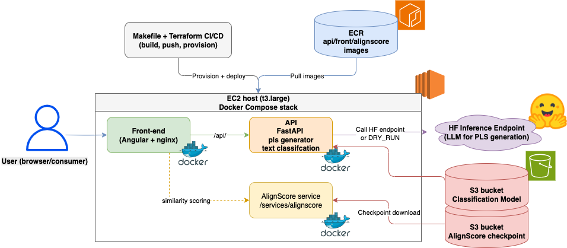
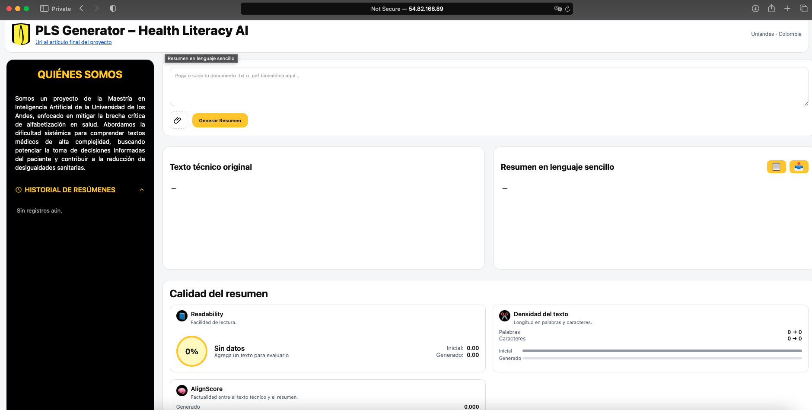
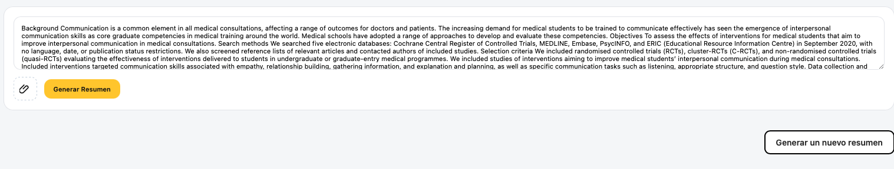
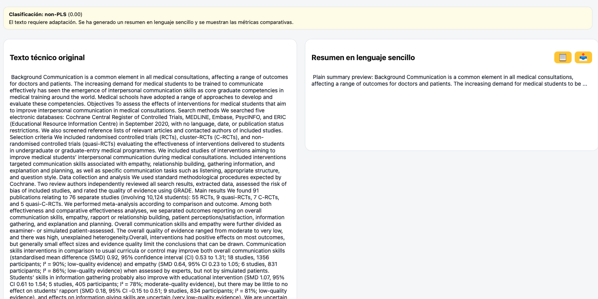
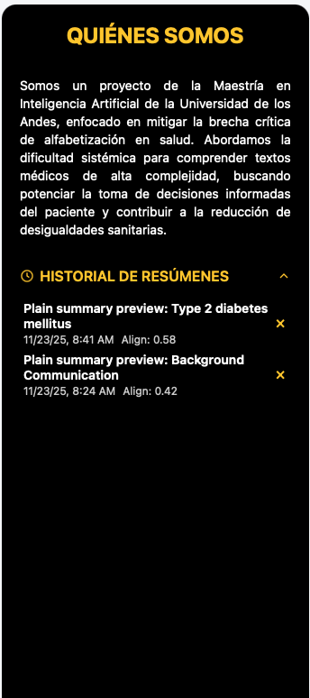

# Proyecto PLS — Visión General

Sistema completo para generar y clasificar resúmenes en lenguaje sencillo (Plain Language Summaries, PLS) de textos biomédicos. Incluye datos curados, notebooks de experimentación, artefactos de modelos (clasificador y generadores afinados) y una arquitectura de despliegue con interfaz (API, Application Programming Interface) FastAPI, microservicio AlignScore y front Angular servido con nginx.

---

## Mapa de carpetas y documentación

- `data/` — splits de entrenamiento/validación/prueba y textos de evaluación. Métricas de longitud y ejemplos en [`data/README.md`](data/README.md).
- `notebooks/` — EDA, clasificador PLS vs no PLS, fine-tuning de generadores (MedGemma, Qwen, Llama) y comparativa de LLMs comerciales. Resumen en [`notebooks/README.md`](notebooks/README.md).
- `models/` — artefactos finales y evidencia visual (clasificador TF-IDF+LogReg y generadores afinados). Detalle en [`models/README.md`](models/README.md).
- `pls_deployment_project/` — stack de despliegue: FastAPI + AlignScore + front Angular/nginx, Docker Compose, Terraform y scripts. Guía en [`pls_deployment_project/README.md`](pls_deployment_project/README.md).
- `outputs/` — resultados de entrenamiento y snapshots de experimentos.

---

## Componentes de Machine Learning

- **Clasificador PLS vs no PLS**: TF-IDF (Term Frequency–Inverse Document Frequency, palabras y caracteres) + LogisticRegression balanceada, umbral configurable. Entrenamiento en `notebooks/pls_classifier_baseline.ipynb` y `notebooks/pls_classifier_v2.ipynb`, artefactos listos para S3/volumen.
- **Generador PLS (MedGemma afinado)**: `google/medgemma-4b-it` con LoRA (Low-Rank Adaptation) 4bit, mejor calidad cualitativa y cuantitativa. Publicado en Hugging Face como `deayala/med-gemma-finetuned` y servido vía endpoint HF Inference.
- **Experimentos adicionales**: pipeline <3B, Llama 3.2 1B y comparativa de LLMs (Large Language Models) comerciales (ChatGPT, Claude, Gemini y Llama) para referencias externas.

---

## Arquitectura de despliegue

- **Front-end (Angular + nginx)**: sirve la interfaz de usuario (UI) y proxy a `/api/` al servicio FastAPI.
- **API FastAPI (contenedor `api`)**: expone `/summarize` y `/classify`, delega generación al endpoint HF (Hugging Face) con MedGemma/Qwen o entra en `DRY_RUN`, carga el clasificador TF-IDF+LogReg desde S3.
- **AlignScore service**: microservicio dedicado al cálculo de similitud factual (`/services/alignscore`), descarga su checkpoint desde S3.
- **Infraestructura**: imágenes `api/front/alignscore` se publican en ECR (Elastic Container Registry), Terraform + Makefile provisionan EC2 (Elastic Compute Cloud, t3.large) y despliegan el stack con Docker Compose.

---

## Uso del front-end (paso a paso)

UI Angular (User Interface) sencilla e intuitiva: todo se concentra en una única vista con formularios claros, resultados visibles sin recargar y paneles laterales para métricas e historial.

1) Pantalla inicial: vista limpia con navegación mínima y acceso directo al flujo principal.  
   

2) Ingreso de texto: área amplia para pegar el artículo técnico, controles de hiperparámetros (temperatura, top_p, longitud) y toggles para clasificar o generar. Validaciones básicas evitan peticiones vacías.  
   

3) Resultado PLS: la salida aparece alineada con el texto de entrada para lectura rápida, botones permiten copiar o iterar manteniendo el contexto.  
   

4) Métricas: panel compacto con legibilidad y, cuando aplica, AlignScore, se muestran etiquetas y valores legibles para un usuario no técnico.  
   

5) Historial: lista cronológica de generaciones previas con fragmentos de entrada/salida para auditoría y reutilización sin perder el estado actual.  
   

---

## Equipo

- Monica Alejandra Alvarez Carrillo.
- Daniel Eduardo Ayala Ramírez.
- Manuela Alejandra Hernandez Otalora.
- Richard Stiv Murcia Huerfano.

---

## Licenciamiento y uso de MedGemma

MedGemma es un modelo abierto basado en Gemma 3 (variantes 4B/27B, texto y multimodal) publicado para acelerar aplicaciones médicas. Puedes usar en este proyecto siempre que cumplas los términos de Health AI Developer Foundations:

- **Uso previsto**: punto de partida para apps de salud/biociencias con texto e imágenes médicas (por ejemplo, reportes de imagen, QA sobre radiografías o resúmenes clínicos).
- **No es clínico listo**: las salidas que entrega este modelo son preliminares, no deben guiar diagnóstico, decisiones terapéuticas ni práctica clínica sin validación independiente.
- **Validación obligatoria**: evalúa en datos representativos de tu contexto (edad, sexo, patología, dispositivo, etc.) y vigila posible contaminación de datos al probar generalización.
- **Sensibilidad al prompt**: MedGemma puede variar más su salida según el texto exacto del prompt que su base Gemma 3. Pequeños cambios de redacción (palabras, orden, tono) pueden alterar la calidad o precisión de la respuesta. Por eso conviene iterar sobre el prompt (probar variantes, ejemplos few-shot, instrucciones claras) y validar los resultados con datos de tu caso de uso antes de adoptarlo.
- **Cumplimiento**: revisa y respeta los términos oficiales antes de desplegar este proyecto: https://developers.google.com/health-ai-developer-foundations/medgemma

---

## Referencias rápidas

- Clasificador: `notebooks/pls_classifier_baseline.ipynb`
- Generador (MedGemma): `notebooks/pls_sft_medgemma.ipynb`
- Generador (Qwen): `notebooks/pls_sft_qwen.ipynb`
- Despliegue: `pls_deployment_project/README.md`
