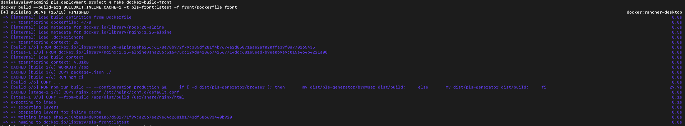
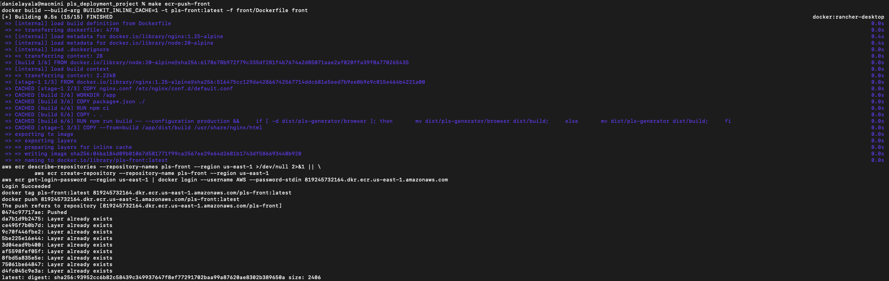
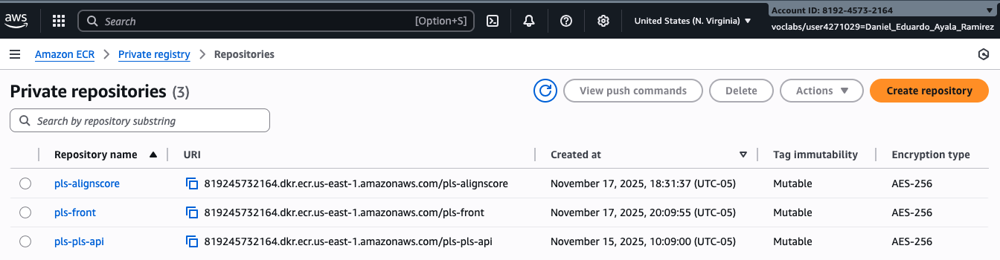
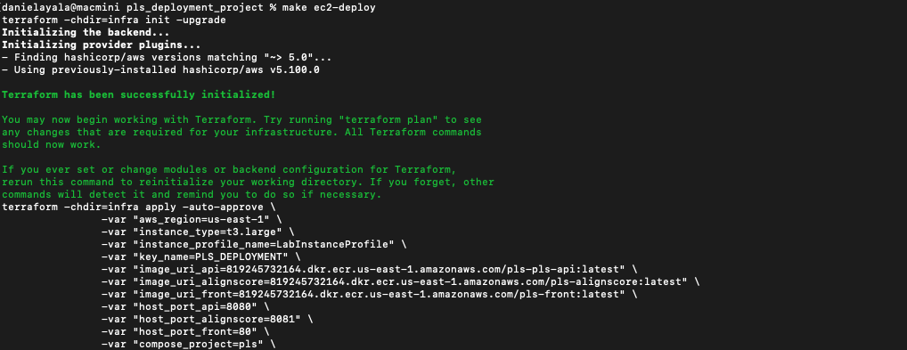
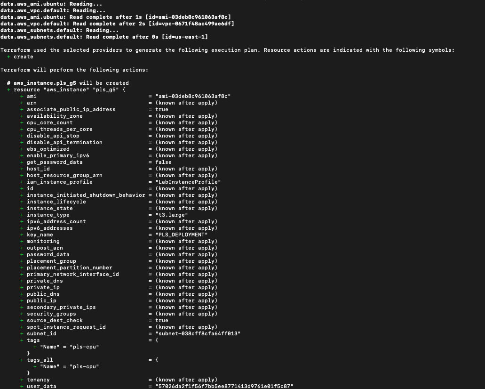
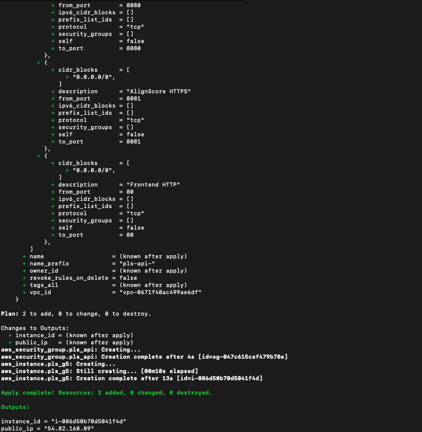
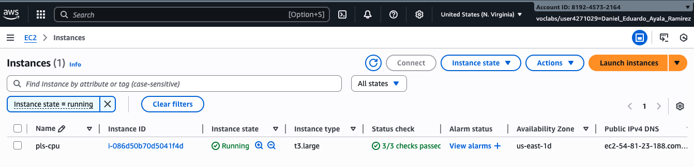
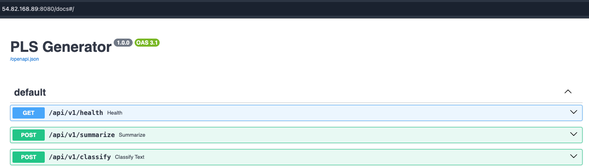
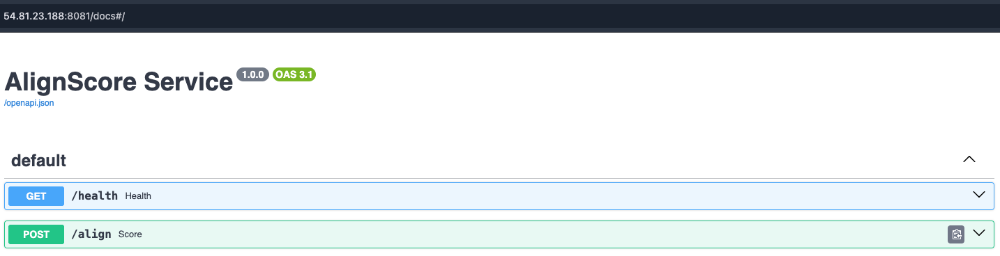
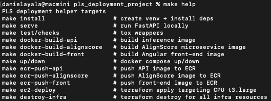

# PLS Deployment Project — README

Plantilla completa para desplegar el Plain Language Summarizer (PLS) con FastAPI, un microservicio AlignScore y un front Angular+nginx empaquetados en Docker y orquestados con Compose sobre EC2. Incluye automatizaciones para construir y publicar imágenes en ECR y para aprovisionar la instancia vía Terraform.

---

## Arquitectura


- El usuario consume el front Angular servido por nginx, que reenvía `/api/*` a FastAPI.
- FastAPI expone `/summarize` y `/classify`, delega la generación al endpoint gestionado de Hugging Face (HF) o usa `DRY_RUN`.
- El clasificador TF-IDF+LogReg se carga desde `models/production`.
- El microservicio AlignScore calcula la similitud vía `/align` usando un checkpoint descargado desde S3.
- Las tres imágenes (api, front, alignscore) se publican en ECR y se despliegan en un EC2 t3.large con Docker Compose.

---

## Precondiciones

- Docker y Docker Compose instalados (el desarrollo original se realizó en macOS con Rancher Desktop).
- AWS CLI configurado con credenciales válidas y permisos para ECR y S3.
- Par de llaves EC2 disponible (`KEY_NAME`) y SG con puertos abiertos según `HOST_PORT_*`.
- Modelos/artefactos accesibles (checkpoint de AlignScore y clasificador en la ruta esperada o montada).

---

## Flujo de despliegue paso a paso

Los siguientes comandos debe ejecutarse en el mismo directorio donde se encuentra este README.md, valide que este disponible el archivo Makefile:

1) **Construcción local de imágenes**  
   `make docker-build-api`, `make docker-build-alignscore` y `make docker-build-front` genera la imagenes necesarias para el proyecto en la maquina local, debe contar con Docker instalado para su ejecución, a continuación esta un ejemplo de la construccion del front el cual despliega Angular+nginx.  
   

2) **Publicación en ECR (Elastic Container Registry)**  
   `make ecr-push-api`, `make ecr-push-alignscore` y `make ecr-push-front` sube las imagen a ECR del front, el mismo flujo aplica a api/alignscore.  
   

3) **Verificación en ECR**  
   Comprobar las tres imágenes (api/front/alignscore) publicadas en el repositorio de ECR.  
   

4) **Provisionamiento con Terraform**  
   `make ec2-deploy` implementa Terraform, crea la instancia EC2 y renderiza `docker-compose.yml` remoto con las imágenes de ECR y variables de entorno.  
     
     
   

5) **Stack en EC2**  
   Una vez levantado, la instancia (t3.large) ejecuta Docker Compose con los servicios `api`, `alignscore` y `front`.  
   

6) **Servicios en ejecución**  
   - `api`: FastAPI para `/summarize` y `/classify`.  
   - `front`: Angular + nginx sirviendo la UI y proxys hacia la API.  
   - `alignscore`: servicio de similitud factual.  
     
   

---

## Componentes clave

- `app/main.py`: router FastAPI (`/health`, `/summarize`, `/classify`), CORS/GZip, `PLSGenerator` + `BinaryPLSClassifier`.
- `app/config.py`: `Settings` valida variables (HF_ENDPOINT_URL, HF_TOKEN, DRY_RUN, rutas de modelo) y resume configuración.
- `app/generator.py`: `PLSGenerator` elige cliente HF (`HFInferenceClient` u `OpenAIChatClient`) o `DummyGenerator` en `DRY_RUN`, calcula métricas de legibilidad y puntúa candidatos.
- `app/schemas.py`: DTOs (Data Transfer Objects) Pydantic para requests/responses y validaciones (mínimo de palabras, rangos de hiperparámetros).
- `src/classifier.py`: `BinaryPLSClassifier` carga el pipeline joblib y aplica un umbral configurable (`meta.json`).
- `src/readability.py`: cálculo de métricas de legibilidad y densidad de jerga, tolera ausencia de `textstat`.
- `services/alignscore/app`: FastAPI aislado con `AlignScoreEngine` (carga lazy, detección de device, checkpoint opcional) para evitar conflictos entre la version Python 3.10 que requiere AlignScore y los demas componentes desarrollados en Python 3.12, expone `/align`.
- `front/`: proyecto Angular servido por nginx (`front/Dockerfile` hace build y copia a `/usr/share/nginx/html`, `nginx.conf` proxy al servicio `api` en la red de Compose).
- `infra/`: Terraform que genera `docker-compose.yml` con las tres imágenes, instala Docker/Compose vía cloud-init y descarga el checkpoint de AlignScore desde S3.
- `Makefile`: objetivos para instalar deps, correr pruebas, construir imágenes y empujar a ECR, y aplicar/destroy Terraform.

---

## Preparación local

1) Variables de entorno  
   ```
   cp .env.example .env
   export AWS_REGION=us-east-1
   export HF_TOKEN=hf_xxx
   export HF_ENDPOINT_URL=https://xxx.aws.endpoints.huggingface.cloud
   export HF_CHAT_MODEL_NAME=deayala/med-gemma-finetuned  # solo para endpoints /chat/completions
   ```
   Usa `DRY_RUN=1` si no tienes endpoint HF pero quieres probar la API.

2) Instalación y chequeos rápidos  
   ```
   make install
   make checks       # ruff + mypy via tox
   make test         # pytest (ligero)
   ```

3) Ejecución local  
   - API en caliente: `make serve` y prueba con `curl -X POST localhost:8080/api/v1/summarize -d '{"article": "..."}'`.
   - Stack Docker: `docker compose up -d` (construye api/front/alignscore). Ajusta `HF_ENDPOINT_URL`, `HF_TOKEN` y `ALIGN_CHECKPOINT_PATH` en tu entorno.
   - Microservicio AlignScore: monta el checkpoint (`ALIGN_CHECKPOINT_PATH`) o deja `DRY_RUN` en la API si no necesitas scoring.

---

## Construcción y publicación de imágenes

- Variables principales en `Makefile`:
  - `API_IMAGE/ALIGN_IMAGE/FRONT_IMAGE` y `*_TAG` para nombres locales.
  - `AWS_ACCOUNT_ID`, `AWS_REGION` y `ECR_URI` para apuntar a tu cuenta.
  - `*_ECR_REPO` controla el nombre de cada repo en ECR (por defecto coincide con el nombre local).
- Login en ECR: `make ecr-login`.
- Construcción local:
  ```
  make docker-build-api
  make docker-build-alignscore
  make docker-build-front   # Angular -> nginx
  ```
- Publicar en ECR:
  ```
  make ecr-push-api
  make ecr-push-alignscore
  make ecr-push-front
  # o todo de una: make ecr-push-all
  ```

---

## Despliegue en AWS con Terraform y Makefile

Requisitos: AWS CLI configurado, rol/instance profile con acceso a ECR + S3 (para el checkpoint AlignScore) y par de llaves EC2 (`KEY_NAME`).

1) Prepara las imágenes en ECR y define `HF_ENDPOINT_URL` y `HF_TOKEN` en tu shell.  
2) Lanza la instancia vía Makefile (ejemplo):
   ```
   make ec2-deploy \
     HF_ENDPOINT_URL=https://xxx.aws.endpoints.huggingface.cloud \
     HF_TOKEN=hf_xxx \
     INSTANCE_TYPE=t3.large \
     ALIGNSCORE_S3_URI=s3://.../AlignScore-base.ckpt \
     HOST_PORT_FRONT=80 HOST_PORT_API=8080 HOST_PORT_ALIGNSCORE=8081
   ```
   - Terraform renderiza `infra/docker-compose.yml.tftpl` con las URIs de las tres imágenes.
   - El user-data instala Docker/Compose, hace login en ECR, descarga el checkpoint a `alignscore_ckpt_host_path` (por defecto `/opt/alignscore/AlignScore-base.ckpt`) y levanta el stack en `/opt/${compose_project}`.
   - Seguridad: el SG abre los puertos `HOST_PORT_FRONT`, `HOST_PORT_API` y `HOST_PORT_ALIGNSCORE`.
3) Validación remota: `ssh` a la instancia y ejecuta `docker compose -f /opt/pls/docker-compose.yml ps` y `curl http://localhost:8080/api/v1/health`.
4) Para destruir la infraestructura desplegada: `make destroy-infra` (o `make ec2-destroy` si solo se desea borrar la instancia).

---

## Infraestructura con Terraform

- Lanza una instancia Spot t3.large (configurable) con Docker. La IAM instance profile debe permitir `AmazonS3ReadOnlyAccess` para descargar el checkpoint de AlignScore desde `alignscore_s3_uri` (por defecto un bucket público).
- El checkpoint se guarda en `/opt/alignscore/AlignScore-base.ckpt` y se monta de solo lectura en el contenedor AlignScore (`/assets/AlignScore-base.ckpt`). Mantén ese path dedicado a AlignScore, el stack de la API vive en `/opt/pls`.
- `infra/docker-compose.yml.tftpl` define los servicios api/alignscore/front con puertos host configurables (`host_port_api` 8080, `host_port_alignscore` 8081, `host_port_front` 80). nginx proxya `/api/*` hacia FastAPI.
- Tras `terraform apply`, verifica en la instancia con `docker compose -f /opt/${compose_project}/docker-compose.yml ps`. Si falta AlignScore, confirma el checkpoint en `/opt/alignscore/AlignScore-base.ckpt` y reanuda con `docker compose up -d alignscore`.
- El front incluye un certificado autofirmado (`/etc/nginx/certs/tls.crt`), monta tu propio par cert/key en ese path para evitar advertencias del navegador.

---

## Endpoints y pruebas rápidas

- API:
  - `GET /api/v1/health`
  - `POST /api/v1/summarize` (recibe `article`, acepta overrides de hiperparámetros)
  - `POST /api/v1/classify` (usa `BinaryPLSClassifier`)
- AlignScore: `POST /align` con `technical_text` y `generation`, responde `align_score`, `model_name`, `device`, `batch_size`.
- Smoke test: `./scripts/smoke_test.sh` golpea `/health` y `/summarize`.

---

## Notas y buenas prácticas

- `.env` carga secretos (HF_TOKEN, credenciales) vía `app/config.py`, no se deben subir secretos al repositorio.
- El modelo de clasificación se encuentra en `models/production/tfidf_logreg`, si se desea usar otro bucket, se debe montar y descargar antes de levantar el contenedor.
- `DRY_RUN=1` mantiene liveness aun sin endpoint HF para pruebas sin inferir en altos costos.
- Ajusta `HOST_PORT_*` y `compose_project` en `Makefile`/Terraform para evitar conflictos de puertos en EC2.
- Para mas información de despliegue y comandos utiles para hacer pruebas locales ejecute `make help`:

