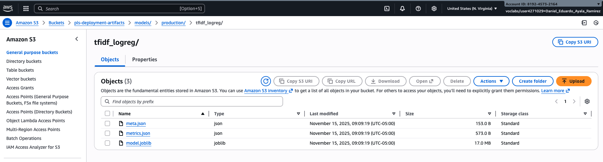
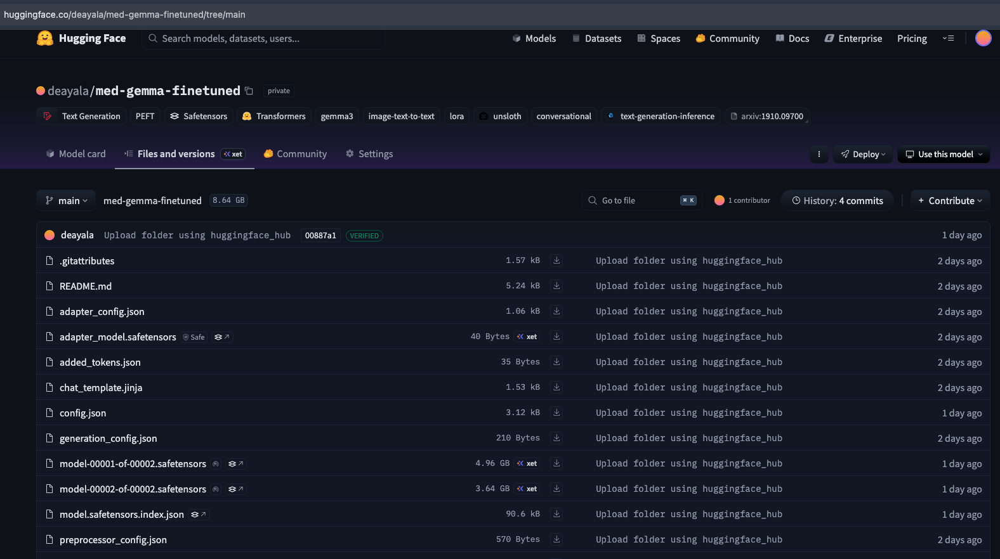
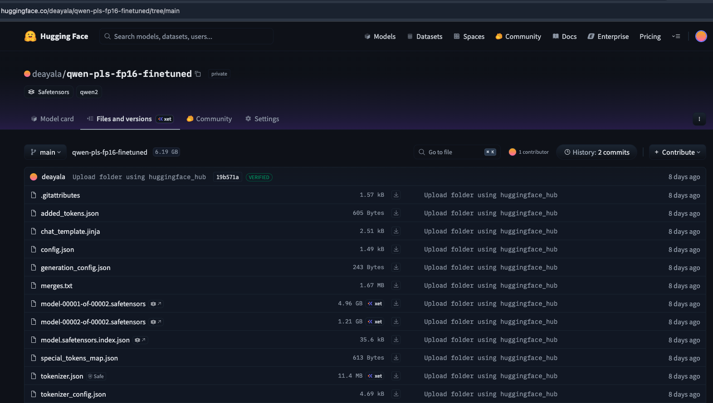
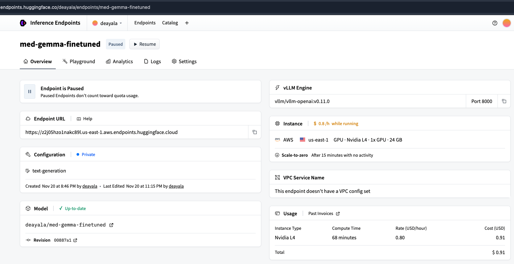
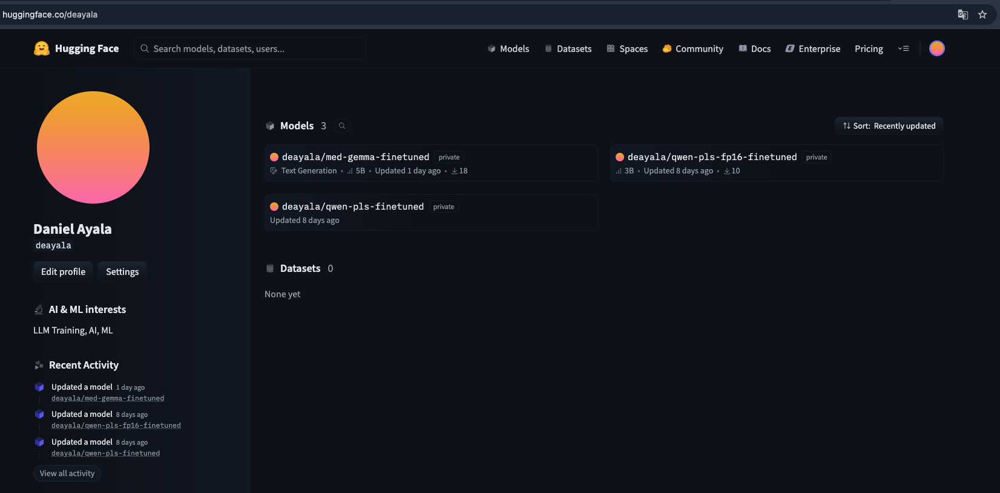

# Models — README

Repositorio de artefactos finales (clasificador y generadores PLS), evidencias visuales asociadas a su entrenamiento y despliegue.

---

## Artefactos y referencias

  
Bucket S3 con el pipeline `model.joblib`, `meta.json` (umbral/versionado) y `metrics.json`, es la fuente que consume la API para `/classify`.

  
Vista del repo `deayala/med-gemma-finetuned` con pesos, configs y adaptadores LoRA (Low-Rank Adaptation) listos para despliegue vía endpoint HF.

  
Repo `deayala/qwen-pls-fp16-finetuned` con safetensors y configuraciones fp16, alternativa más liviana al generador principal.

  
Endpoint Hugging Face Inference (motor vLLM) configurado para servir el modelo MedGemma afinado y ser llamado por la API FastAPI el path para `/summarize`.

  
Perfil `deayala` mostrando la publicación de los modelos (MedGemma y Qwen afinados) usados en la arquitectura.

---

## Clasificador PLS vs no PLS

- Modelo: TF‑IDF (uni/bi-gramas de palabras + 3–5 gram de caracteres) + `LogisticRegression` balanceada (`solver=saga`, `C=2.0`, `max_iter=2000`).
- Entrenamiento documentado en `notebooks/pls_classifier_baseline.ipynb` (y ajustes en `pls_classifier_v2.ipynb`).
- Artefactos: `model.joblib`, `meta.json` (umbral y versión), `metrics.json` (métricas de validación). Referencia visual en `assets/classifier_s3_tfidf_logreg.png`.
- Uso en la arquitectura: la API FastAPI carga el pipeline desde S3 (o volumen montado) y expone `/api/v1/classify` para etiquetar textos como PLS o no PLS.

---

## Generadores PLS (fine-tuning)

### MedGemma afinado
- Base: `google/medgemma-4b-it`.
- Afinación: LoRA (Low-Rank Adaptation) en 4 bits (`r=16`, `lora_alpha=32`, `dropout=0.05`, módulos q/k/v/o), sin packing, prompt con rol de *Health Literacy Expert* para producir PLS de nivel ~8.º grado.
- Documentado en `notebooks/pls_sft_medgemma.ipynb`; evidencias en `assets/pls_gemma-finetunning.png`.
- Despliegue: publicado como `deayala/med-gemma-finetuned` y servido vía endpoint HF Inference (vLLM) mostrado en `assets/endpoint_gemma-finetunning.png`.
- Resultado: mejor desempeño cualitativo y cuantitativo entre los generadores experimentados.

### Qwen afinado
- Base: Qwen (fp16) afinado con LoRA/QLoRA en Colab L4.
- Documentado en `notebooks/pls_sft_qwen.ipynb`; evidencias en `assets/pls_qwen_finetunning.png`.
- Publicado como `deayala/qwen-pls-fp16-finetuned` en Hugging Face.

### Otros experimentos
- `notebooks/pls_generator_pipeline.ipynb`: pipeline generador <3B.
- `notebooks/pls_stf_llama.ipynb`: SFT de Llama 3.2 1B para entornos con memoria restringida.
- `notebooks/pls_laysumm_stepbystep_backup.ipynb`: respaldo operativo del flujo QLoRA + AWS.

---

## Integración en la arquitectura

En la arquitectura de despliegue (`pls_deployment_project/assets/pls_architecture.drawio.png`):
- El endpoint HF Inference sirve el generador PLS (MedGemma afinado; opcionalmente Qwen).
- La API FastAPI (contenedor `api`) llama al endpoint HF o entra en `DRY_RUN`; usa el clasificador TF‑IDF+LogReg local desde S3/montaje.
- El microservicio AlignScore consume su checkpoint desde S3 para scoring de similitud.
- Las imágenes (api/front/alignscore) se publican en ECR y se orquestan con Docker Compose en EC2 (`t3.large`), con provisión vía Makefile + Terraform.

---

## Nota

Todos los modelos se usan exclusivamente con fines académicos/experimentales siguiendo las licencias de sus fuentes.
